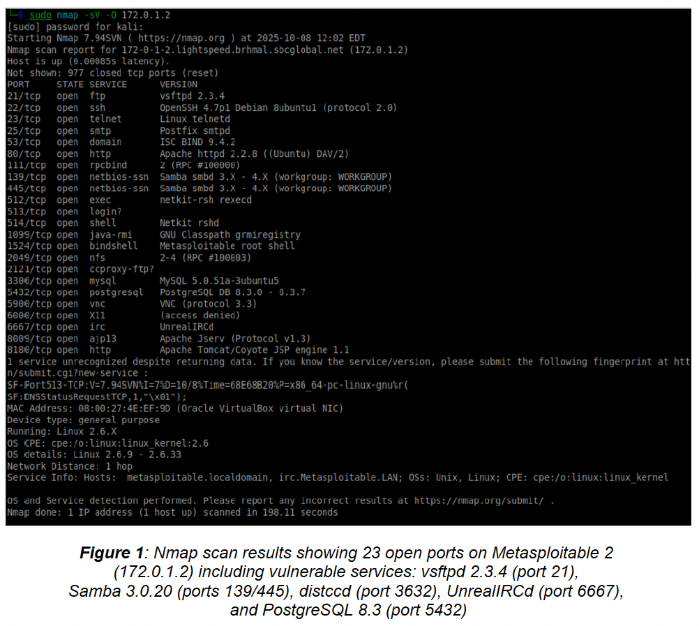
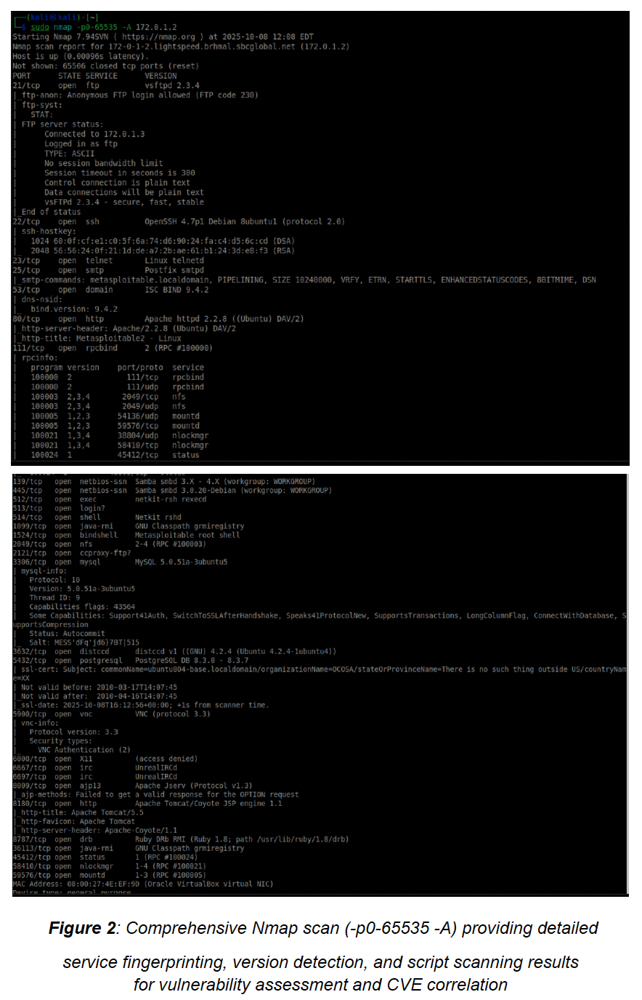
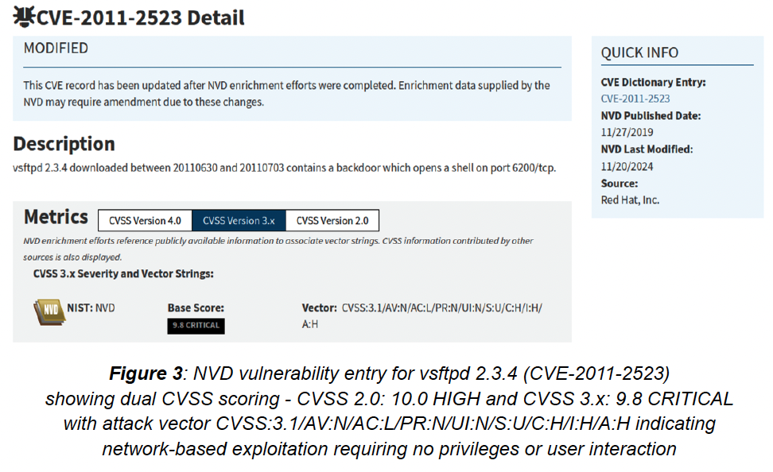
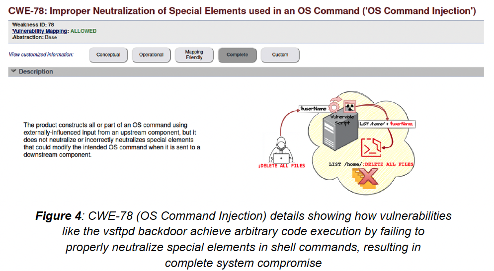

# 🔍 Portfolio 1: Vulnerability Management

## 📋 Overview

This portfolio demonstrates comprehensive vulnerability assessment and prioritization methodology using industry-standard tools (Nmap, NVD) against a deliberately vulnerable environment (Metasploitable 2).

**Key Skills Demonstrated:**
- Network reconnaissance and service enumeration
- CVSS-based vulnerability prioritization
- CVE/CWE correlation and analysis
- Risk-based remediation planning

---

## 🛠️ Tools & Environment

| Tool | Version | Purpose |
|------|---------|---------|
| Nmap | 7.94SVN | Network scanning, service detection, OS fingerprinting |
| NVD Database | - | Vulnerability intelligence, CVSS scoring |
| Metasploitable 2 | - | Target environment (intentionally vulnerable) |
| Kali Linux | 2024.2 | Attack simulation platform |

**Network Configuration:**
```
Kali VM (Attacker): 172.0.0.100
Metasploitable 2 (Target): 172.0.1.2
```

---

## 📊 Phase 1: Network Reconnaissance

### Initial Service Discovery

Performed comprehensive port scanning to identify all running services on the target system.

**Command:**
```bash
sudo nmap -sV -O 172.0.1.2
```

**Parameters:**
- `-sV`: Service version detection
- `-O`: Operating system fingerprinting


*Figure 1: Nmap scan results showing 23 open ports on Metasploitable 2, including vulnerable services like vsftpd 2.3.4 (port 21), Samba 3.0.20 (ports 139/445), and UnrealIRCd (port 6667)*

**Key Findings:**
- **23 open ports** discovered
- Multiple high-risk services identified:
  - FTP (vsftpd 2.3.4) - Known backdoor vulnerability
  - SSH (OpenSSH 4.7p1) - Outdated version
  - SMB (Samba 3.0.20) - Command injection vulnerability
  - IRC (UnrealIRCd) - Backdoor trojan

---

### Comprehensive Port Enumeration

Conducted exhaustive port scan with detailed service fingerprinting for vulnerability correlation.

**Command:**
```bash
sudo nmap -p0-65535 -A 172.0.1.2
```

**Parameters:**
- `-p0-65535`: Scan all 65,536 ports
- `-A`: Aggressive scan (OS detection, version detection, script scanning, traceroute)


*Figure 2: Detailed service fingerprinting results showing exact version numbers for CVE correlation, including MySQL 5.0.51a, PostgreSQL 8.3, and Apache Tomcat*

**Additional Discoveries:**
- MySQL 5.0.51a (port 3306) - Multiple SQL injection vulnerabilities
- PostgreSQL 8.3.0-8.3.7 (port 5432) - Privilege escalation (CVE-2013-1899)
- distccd (port 3632) - Remote code execution (CVE-2004-2687)
- Apache Tomcat (port 8180) - Default credentials, manager bypass

---

## 🔬 Phase 2: Vulnerability Intelligence Gathering

### NVD Database Analysis

Correlated discovered services with National Vulnerability Database (NVD) to obtain:
- CVE identifiers
- CVSS severity scores
- CWE weakness classifications
- Remediation guidance

#### Example: vsftpd 2.3.4 Backdoor (CVE-2011-2523)


*Figure 3: NVD database entry for CVE-2011-2523 showing CVSS 3.x score of 9.8 CRITICAL with attack vector CVSS:3.1/AV:N/AC:L/PR:N/UI:N/S:U/C:H/I:H/A:H*

**Vulnerability Details:**
| Attribute | Value |
|-----------|-------|
| CVE ID | CVE-2011-2523 |
| CVSS 2.0 Score | 10.0 HIGH |
| CVSS 3.x Score | 9.8 CRITICAL |
| Attack Vector | Network (AV:N) |
| Attack Complexity | Low (AC:L) |
| Privileges Required | None (PR:N) |
| User Interaction | None (UI:N) |

**Attack Mechanism:**
- Compromised vsftpd source code distributed between June 30 - July 3, 2011
- Backdoor triggers when username contains `:)` (smiley face)
- Opens root shell on port 6200/tcp

---

### Weakness Classification (CWE)


*Figure 4: CWE-78 (OS Command Injection) showing how the vsftpd backdoor achieves arbitrary code execution by failing to neutralize special elements in shell commands*

**CWE-78: Improper Neutralization of Special Elements used in an OS Command**

This weakness classification indicates:
- **Root Cause:** Input validation failure
- **Impact:** Complete system compromise
- **Prevalence:** Common in legacy software
- **Detection:** Static analysis, code review

---

## 📈 Phase 3: Risk Prioritization

### Prioritization Methodology

Vulnerabilities were ranked using multi-factor risk assessment:

| Priority | Factor | Weight |
|----------|--------|--------|
| 1 | CVSS Severity Score | 30% |
| 2 | Exploit Availability | 25% |
| 3 | Attack Complexity | 20% |
| 4 | Authentication Required | 15% |
| 5 | Business Impact | 10% |

### Top 5 Critical Vulnerabilities

| Rank | Service | CVE | CVSS | Exploit Available | Priority |
|------|---------|-----|------|-------------------|----------|
| 1 | vsftpd 2.3.4 | CVE-2011-2523 | 9.8 Critical | ✅ Metasploit | **CRITICAL** |
| 2 | distccd | CVE-2004-2687 | 9.3 High | ✅ Metasploit | **CRITICAL** |
| 3 | UnrealIRCd | CVE-2010-2075 | 7.5 High | ✅ Metasploit | **HIGH** |
| 4 | Samba 3.0.20 | CVE-2007-2447 | 6.0 Medium | ✅ Metasploit | **HIGH** |
| 5 | PostgreSQL 8.3 | CVE-2013-1899 | 6.5 Medium | ✅ Public PoC | **MEDIUM** |

---

## 🛡️ Phase 4: Remediation Recommendations

### Immediate Actions (Within 24 Hours)

| Vulnerability | Remediation |
|---------------|-------------|
| vsftpd 2.3.4 | Upgrade to vsftpd 3.0.3+, verify source integrity with GPG |
| distccd | Disable service, implement IP-based ACLs if required |
| UnrealIRCd | Upgrade to 3.2.9+, verify SHA256 checksums |

### Short-term Actions (Within 7 Days)

| Vulnerability | Remediation |
|---------------|-------------|
| Samba 3.0.20 | Upgrade to Samba 4.x, restrict SMB to internal networks |
| PostgreSQL 8.3 | Upgrade to 9.x+, revoke COPY privileges from non-admin users |

### Long-term Strategy

1. **Patch Management:** Implement automated vulnerability scanning (OpenVAS)
2. **Network Segmentation:** Isolate critical services in separate VLANs
3. **Defense in Depth:** Deploy IDS/IPS (see [Portfolio 2](../02-intrusion-detection-snort/))

---

## 🔗 Complementary Controls

### OpenVAS Integration

While Nmap provides initial discovery and NVD provides intelligence, **OpenVAS** completes the vulnerability management lifecycle:

| Capability | Nmap | NVD | OpenVAS |
|------------|------|-----|---------|
| Service Discovery | ✅ | ❌ | ✅ |
| Version Detection | ✅ | ❌ | ✅ |
| CVE Correlation | Manual | ✅ | ✅ Automated |
| Authenticated Scans | Limited | ❌ | ✅ |
| Compliance Checks | ❌ | ❌ | ✅ |
| Remediation Tracking | ❌ | ❌ | ✅ |

**Recommended Workflow:**
```
Nmap (Discovery) → NVD (Intelligence) → OpenVAS (Continuous Monitoring)
```

---

## 📚 Key Learnings

1. **Prioritization is Critical:** Not all vulnerabilities are equal - focus on exploitable, high-impact issues first

2. **Context Matters:** CVSS score alone is insufficient; consider exploit availability and business impact

3. **Automation is Essential:** Manual vulnerability correlation doesn't scale; integrate with SIEM for continuous monitoring

4. **Defense in Depth:** Vulnerability management is one layer; combine with IDS ([Portfolio 2](../02-intrusion-detection-snort/)) and SIEM ([Portfolio 4](../04-siem-wazuh/))

---

## 🔗 Related Portfolios

| Portfolio | Connection |
|-----------|------------|
| [Intrusion Detection (Snort)](../02-intrusion-detection-snort/) | Detect exploitation attempts against identified vulnerabilities |
| [Proxy Architecture](../03-proxy-architecture/) | Network segmentation to limit vulnerability exposure |
| [SIEM (Wazuh)](../04-siem-wazuh/) | Centralized vulnerability alert correlation |
