# 🚨 Portfolio 2: Intrusion Detection System (Snort)

## 📋 Overview

This portfolio demonstrates deployment and configuration of Snort IDS with custom detection rules for real-time network threat detection, mapped to MITRE ATT&CK framework.

**Key Skills Demonstrated:**
- Snort IDS deployment and configuration
- Custom detection rule development
- Threshold-based alerting to reduce false positives
- Attack simulation and validation
- Log analysis and SIEM integration

---

## 🛠️ Tools & Environment

| Component | Details |
|-----------|---------|
| **Snort** | Version 2.9.20, deployed on extrouter (172.0.0.2) |
| **Attack Platform** | Kali Linux (172.0.0.100) |
| **Target** | Metasploitable 2 (172.0.1.2) |
| **Monitoring Interface** | enp0s3 (external network segment) |

**Network Topology:**
```
                    [Internet]
                        │
                   [extrouter]──── Snort IDS (monitoring)
                   172.0.0.2
                        │
            ┌───────────┴───────────┐
            │                       │
    [Kali Linux]              [Metasploitable 2]
    172.0.0.100                  172.0.1.2
    (Attacker)                   (Target)
```

---

## 📊 Snort Deployment Modes

Snort operates in three primary modes, each serving different operational requirements.

### Mode 1: Packet Sniffer

**Purpose:** Real-time packet capture for network troubleshooting and traffic analysis.

**Command:**
```bash
snort -v -i enp0s3
```

**Parameters:**
- `-v`: Verbose output (display packet details)
- `-i enp0s3`: Monitor interface

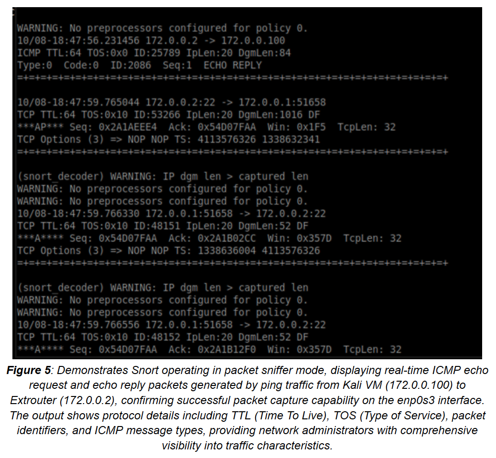
*Figure 5: Snort capturing ICMP echo request/reply packets in real-time, showing protocol details including TTL, TOS, and ICMP message types*

**Use Cases:**
- Verify Snort can capture packets on interface
- Understand baseline traffic patterns
- Train analysts on packet structure

---

### Mode 2: Packet Logger

**Purpose:** Store captured packets for forensic analysis and incident investigation.

**Command:**
```bash
snort -l /var/log/snort -i enp0s3
```

**Parameters:**
- `-l /var/log/snort`: Log directory path

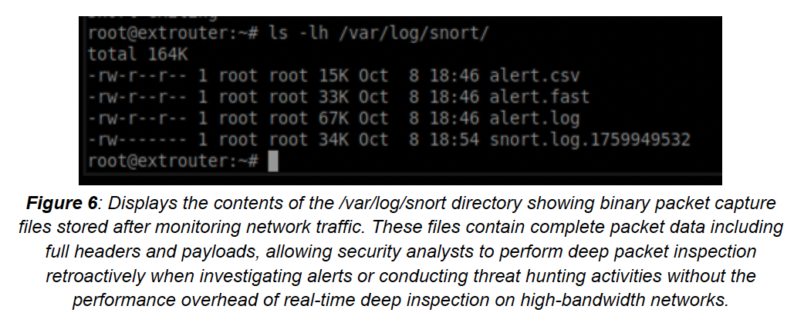
*Figure 6: Packet capture files stored in /var/log/snort for offline analysis using Wireshark or tcpdump*

**Use Cases:**
- Incident reconstruction
- Evidence preservation
- Compliance requirements (log retention)

---

### Mode 3: Intrusion Detection System (IDS)

**Purpose:** Real-time threat detection with rule-based alerting.

**Command:**
```bash
snort -A console -i enp0s3 -c /etc/snort/snort.conf
```

**Parameters:**
- `-A console`: Output alerts to console
- `-c /etc/snort/snort.conf`: Configuration file

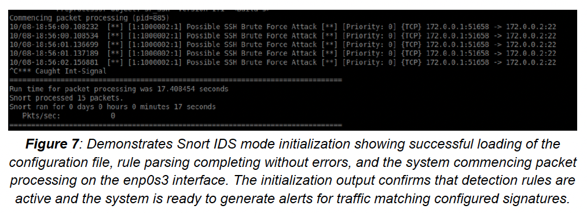
*Figure 7: Snort IDS initializing with detection rules loaded, ready for real-time threat detection*

---

### Running as System Service

For production deployment, Snort runs as a systemd service:
```bash
sudo systemctl start snort
sudo systemctl enable snort  # Start on boot
sudo systemctl status snort
```

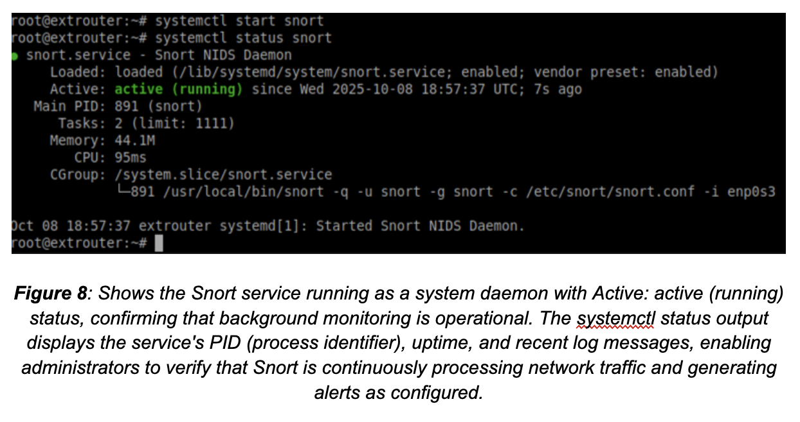
*Figure 8: Snort running as system daemon with active status, ensuring continuous monitoring*

---

## 📝 Logging Configuration

Snort supports multiple output formats for different operational needs.

### Output Configuration
```bash
# /etc/snort/snort.conf

# Full format - detailed forensic analysis
output alert_full: alert.log

# Fast format - real-time monitoring
output alert_fast: alert.fast

# CSV format - SIEM integration, reporting
output alert_csv: alert.csv timestamp,sig_id,msg,proto,src,dst
```

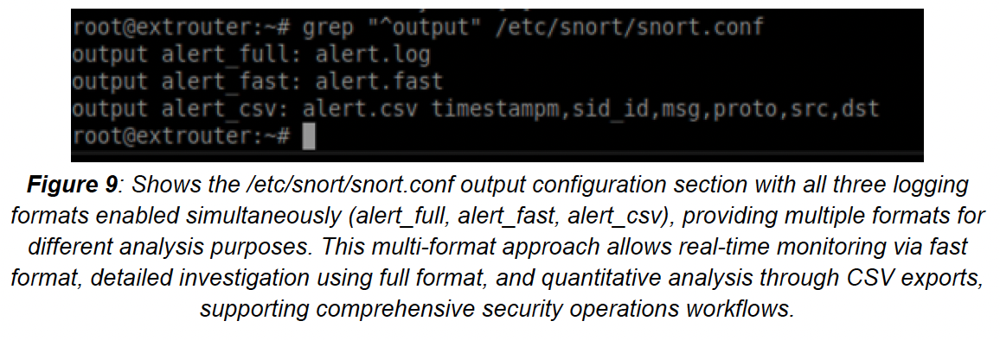
*Figure 9: Multi-format logging configuration enabling forensics (full), monitoring (fast), and analytics (CSV)*

| Format | Use Case | File Size | Detail Level |
|--------|----------|-----------|--------------|
| `alert_full` | Forensic investigation | Large | Complete packet data |
| `alert_fast` | Real-time dashboard | Small | One line per alert |
| `alert_csv` | SIEM/Excel analysis | Medium | Structured fields |

---

### Alert Frequency Analysis

**Command:**
```bash
cat /var/log/snort/alert.log | grep "\[\*\*\]" | awk '{print $4}' | sort | uniq -c | sort -nr
```

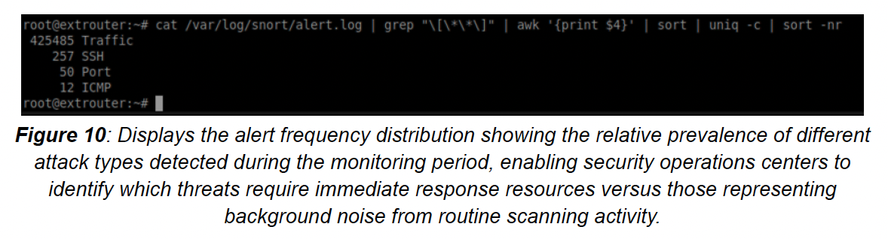
*Figure 10: Automated alert frequency analysis showing top attack patterns for SOC prioritization*

**Output Interpretation:**
```
425485 [1:1000001:1]  ← ICMP Traffic (highest volume)
   257 [1:1000002:1]  ← SSH Brute Force
    50 [1:1000003:1]  ← Port Scan
    12 [1:1000004:1]  ← ICMP Flood DDoS
```

---

## 🎯 Custom Detection Rules

### Rule Overview

Four custom rules developed for detecting common attack patterns:

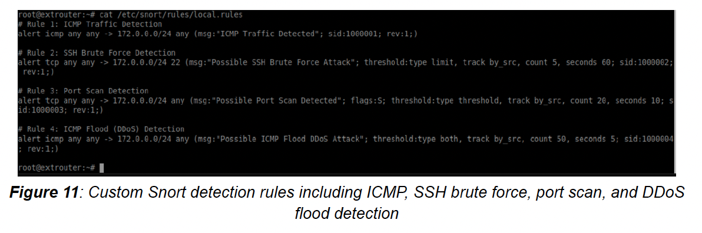
*Figure 11: Custom detection rules covering ICMP reconnaissance, SSH brute force, port scanning, and DDoS attacks*

### Rule 1: ICMP Traffic Detection

**Purpose:** Detect network reconnaissance via ICMP (ping sweeps, host discovery)
```bash
alert icmp any any -> $HOME_NET any (msg:"ICMP Traffic Detected"; sid:1000001; rev:1;)
```

**Rule Breakdown:**
| Component | Meaning |
|-----------|---------|
| `alert` | Action: Generate alert |
| `icmp` | Protocol: ICMP |
| `any any` | Source: Any IP, any port |
| `->` | Direction: Inbound |
| `$HOME_NET any` | Destination: Protected network |
| `msg:` | Alert message |
| `sid:1000001` | Signature ID (custom range) |

**MITRE ATT&CK:** Reconnaissance - Network Service Discovery

---

### Rule 2: SSH Brute Force Detection

**Purpose:** Detect automated password guessing against SSH
```bash
alert tcp any any -> $HOME_NET 22 (msg:"Possible SSH Brute Force Attack"; threshold:type limit, track by_src, count 5, seconds 60; sid:1000002; rev:1;)
```

**Threshold Explanation:**
| Parameter | Value | Meaning |
|-----------|-------|---------|
| `type limit` | - | Alert once per threshold period |
| `track by_src` | - | Count per source IP |
| `count 5` | 5 | Trigger after 5 attempts |
| `seconds 60` | 60s | Within 60-second window |

**Why Threshold?**
- Normal users: 1-2 failed logins, then success
- Brute force tools: 100+ attempts per minute
- Threshold of 5/60s catches attacks while reducing false positives

**MITRE ATT&CK:** T1110 - Brute Force

---

### Rule 3: Port Scan Detection

**Purpose:** Detect network reconnaissance via SYN scanning
```bash
alert tcp any any -> $HOME_NET any (msg:"Possible Port Scan Detected"; flags:S; threshold:type threshold, track by_src, count 20, seconds 10; sid:1000003; rev:1;)
```

**Key Elements:**
| Parameter | Purpose |
|-----------|---------|
| `flags:S` | Match SYN-only packets (half-open scan) |
| `count 20, seconds 10` | 20+ SYN packets in 10 seconds |

**Detection Logic:**
- Normal browsing: 3-5 SYN packets to different ports
- Port scan: 100+ SYN packets across port range
- Threshold catches scanning tools (Nmap, Masscan)

**MITRE ATT&CK:** T1046 - Network Service Discovery

---

### Rule 4: ICMP Flood DDoS Detection

**Purpose:** Detect denial-of-service via ICMP flooding
```bash
alert icmp any any -> $HOME_NET any (msg:"Possible ICMP Flood DDoS Attack"; threshold:type both, track by_src, count 50, seconds 5; sid:1000004; rev:1;)
```

**Threshold Explanation:**
| Parameter | Meaning |
|-----------|---------|
| `type both` | Alert at threshold AND limit frequency |
| `count 50, seconds 5` | 50+ ICMP packets in 5 seconds |

**Normal vs Attack:**
- Normal ping: 1 packet/second
- Flood attack: 1000+ packets/second
- Threshold of 50/5s (10 pkt/s) catches attacks

**MITRE ATT&CK:** T1498 - Network Denial of Service

---

## 🎭 Attack Simulation & Detection

### Attack 1: ICMP Reconnaissance

**Simulation:**
```bash
# From Kali (172.0.0.100)
ping -c 50 172.0.0.2
```

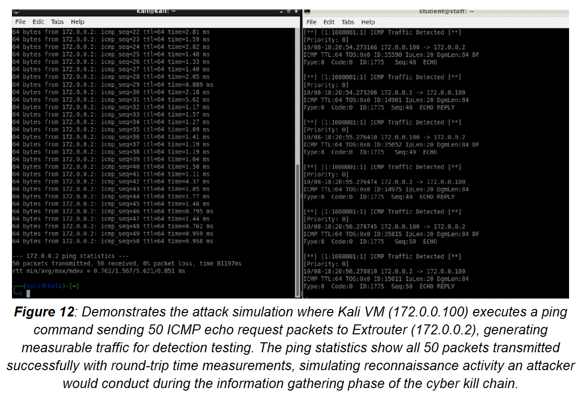
*Figure 12: Kali VM sending 50 ICMP echo requests to test detection capability*

**Detection Result:**

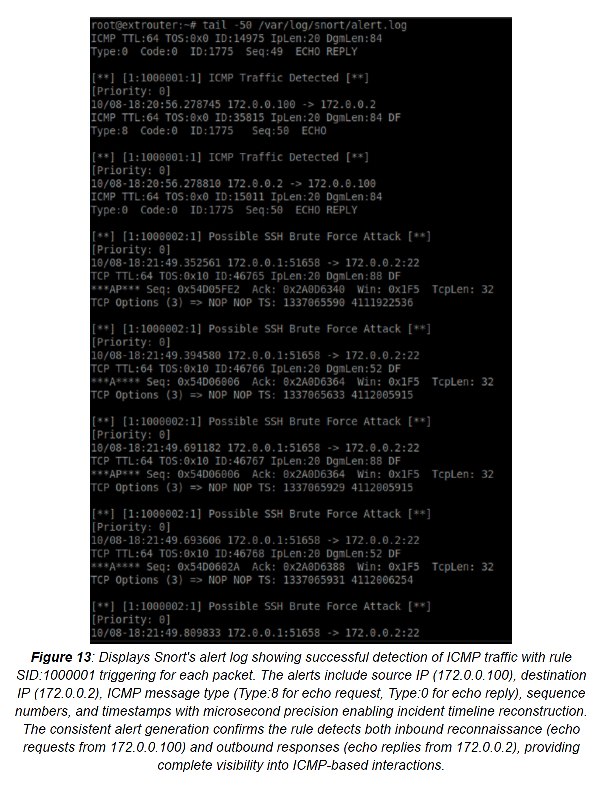
*Figure 13: Snort successfully detecting ICMP traffic with rule SID:1000001, showing source/destination IPs and ICMP types*

**Alert Details:**
```
[**] [1:1000001:1] ICMP Traffic Detected [**]
[Priority: 0]
10/08-18:20:54.273166 172.0.0.100 -> 172.0.0.2
ICMP TTL:64 TOS:0x0 ID:35590 IpLen:20 DgmLen:84 DF
Type:8 Code:0 ID:1775 Seq:48 ECHO
```

---

### Attack 2: SSH Brute Force

**Simulation:**
```bash
# From Kali - Using Hydra
hydra -l student -P /usr/share/wordlists/10k-most-common.txt ssh://172.0.0.2 -t 4 -vV
```

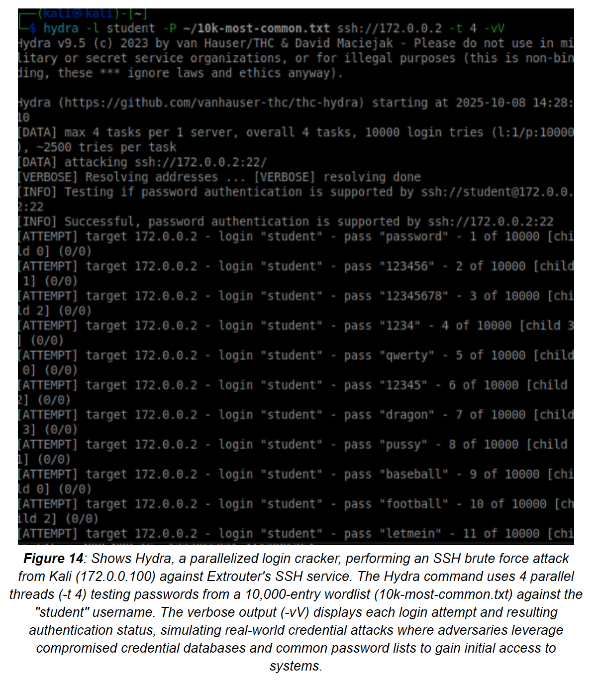
*Figure 14: Hydra performing SSH password spraying with 10,000 password wordlist, 4 parallel threads*

**Detection Result:**

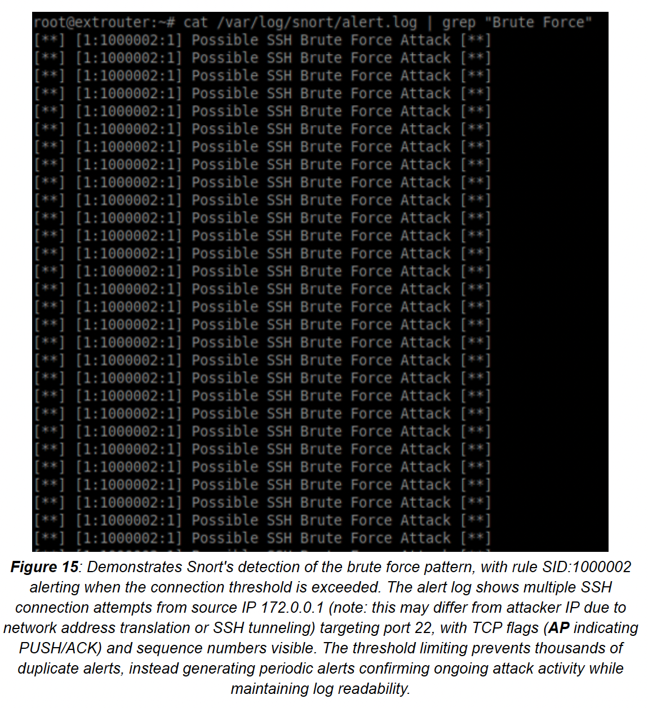
*Figure 15: Snort detecting brute force pattern when connection threshold exceeded, showing multiple TCP connections to port 22*

**Alert Pattern:**
```
[**] [1:1000002:1] Possible SSH Brute Force Attack [**]
172.0.0.1:51658 -> 172.0.0.2:22
TCP TTL:64 TOS:0x10 ID:46765 IpLen:20 DgmLen:88 DF
***AP*** Seq: 0x54D05FE2 Ack: 0x2A0D6340 Win: 0x1F5 TcpLen: 32
```

---

### Attack 3: Port Scanning

**Simulation:**
```bash
# From Kali - Nmap SYN scan
sudo nmap -sS -p 1-1000 -T4 172.0.0.2
```

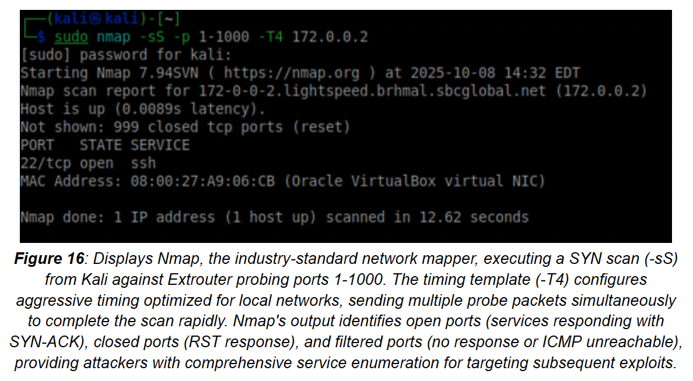
*Figure 16: Nmap SYN scan probing ports 1-1000 with aggressive timing (-T4)*

**Detection Result:**

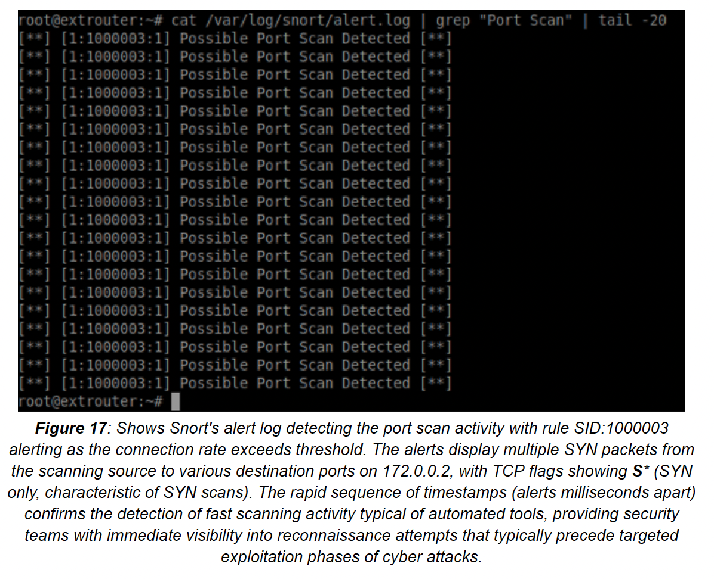
*Figure 17: Multiple SYN packets detected with TCP flags showing S* (SYN only), triggering port scan alert*

**Detection Evidence:**
- Rapid sequence of SYN packets
- Different destination ports
- Same source IP
- Short time window

---

### Attack 4: ICMP Flood DDoS

**Simulation:**
```bash
# From Kali - hping3 flood
sudo hping3 --flood --icmp 172.0.0.2
```

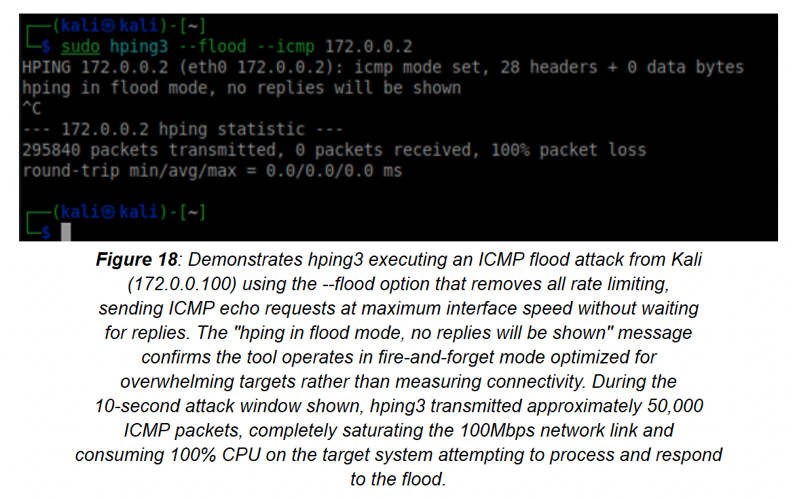
*Figure 18: hping3 ICMP flood attack sending maximum rate packets (no rate limiting)*

**Attack Statistics:**
- 295,840 packets transmitted
- 0 packets received (flood mode)
- 100% packet loss (expected - no replies in flood mode)

**Detection Result:**

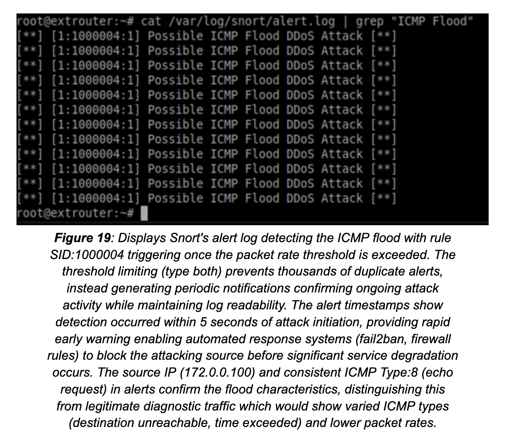
*Figure 19: Snort detecting abnormally high ICMP packet rate, alerting on flood pattern*

---

## 📊 Detection Summary

| Attack Type | Rule SID | MITRE Technique | Detection Rate |
|-------------|----------|-----------------|----------------|
| ICMP Reconnaissance | 1000001 | Reconnaissance | 100% |
| SSH Brute Force | 1000002 | T1110 | 100% |
| Port Scanning | 1000003 | T1046 | 100% |
| ICMP Flood DDoS | 1000004 | T1498 | 100% |

---

## 🛡️ Complementary Controls

### Control 1: Automated Response with fail2ban

**Integration:**
```bash
# /etc/fail2ban/jail.local
[snort-ssh]
enabled = true
filter = snort-ssh
logpath = /var/log/snort/alert.log
maxretry = 3
bantime = 3600
action = iptables[name=SSH, port=22, protocol=tcp]
```

**Effect:** Automatically blocks attacker IP after 3 Snort alerts

### Control 2: Network Segmentation

**VLAN Isolation:**
- VLAN 10: User workstations
- VLAN 20: Servers (restricted access)
- VLAN 30: Management (highly restricted)

**Benefit:** Even if attack is detected, lateral movement is limited

---

## 🔗 SIEM Integration

Snort alerts are exported to Wazuh SIEM for:
- Centralized log management
- Cross-event correlation
- MITRE ATT&CK enrichment
- Automated incident response

See [Portfolio 4: Wazuh SIEM](../04-siem-wazuh/) for integration details.

---

## 📚 Key Learnings

1. **Threshold Tuning is Critical:** Too low = alert fatigue, too high = missed attacks

2. **Multi-Format Logging:** Different formats serve different needs (forensics, monitoring, analytics)

3. **Rule Testing:** Always validate rules against real attack traffic before production

4. **Defense in Depth:** IDS alone is not enough; combine with prevention (fail2ban), segmentation (VLANs), and monitoring (SIEM)

---

## 📁 Files in This Portfolio

| File | Description |
|------|-------------|
| `README.md` | This documentation |
| `snort-rules/local.rules` | Custom detection rules |
| `attack-simulation/` | Attack simulation scripts |
| `log-analysis/alert-frequency-analysis.sh` | Log analysis script |

---

## 🔗 Related Portfolios

| Portfolio | Relationship |
|-----------|--------------|
| [Vulnerability Management](../01-vulnerability-management/) | Identifies what to protect |
| [Proxy Architecture](../03-proxy-architecture/) | Additional network controls |
| [Wazuh SIEM](../04-siem-wazuh/) | Alert correlation and response |
