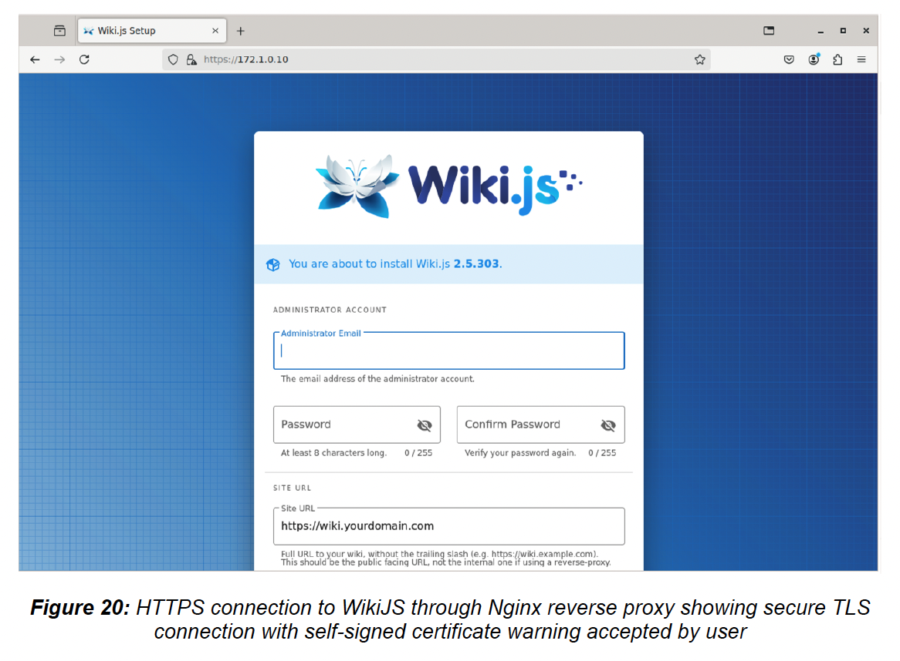
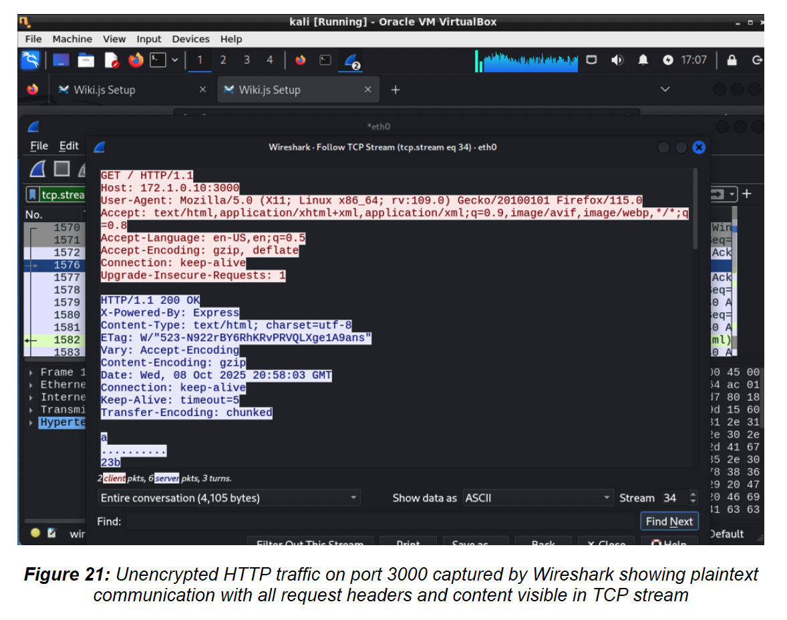
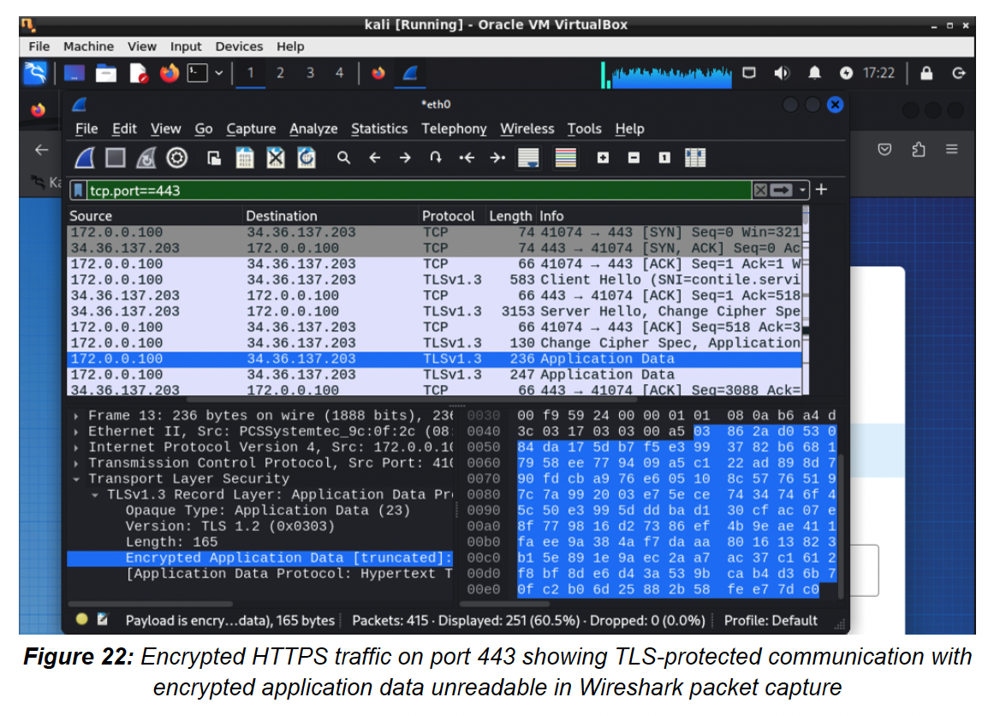
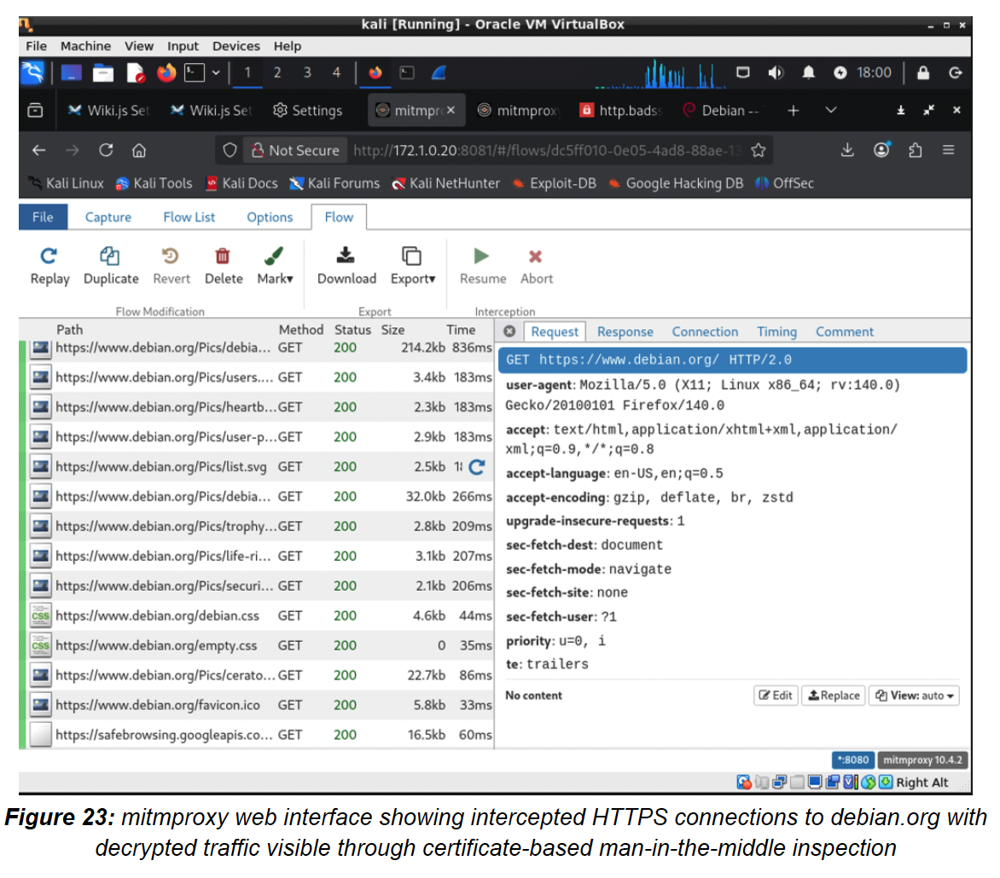
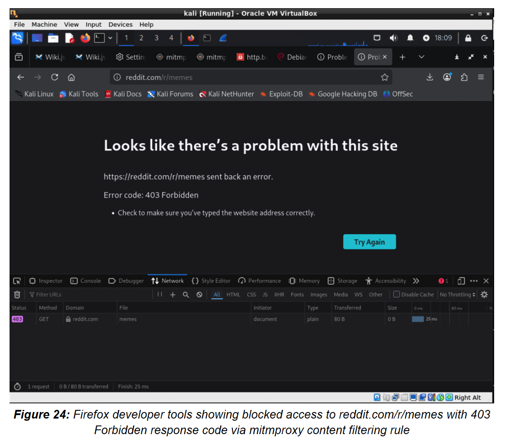

# 🔐 Portfolio 3: Secure Proxy Architecture

## 📋 Overview

This portfolio demonstrates defense-in-depth proxy architecture implementing CIA triad principles through reverse proxy (Nginx) and forward proxy (mitmproxy) configurations.

**Key Skills Demonstrated:**
- Reverse proxy deployment with TLS/HTTPS
- Forward proxy with HTTPS inspection
- Content filtering and access control
- CIA triad implementation (Confidentiality, Integrity, Availability)
- Certificate management

---

## 🏗️ Architecture Overview
```
┌─────────────────────────────────────────────────┐
│              External Network                    │
│                (Internet)                        │
└────────────────────┬────────────────────────────┘
                     │ HTTPS (443)
                     │ TLS Encrypted
                     ▼
        ┌────────────────────────────┐
        │   Nginx Reverse Proxy      │
        │     172.1.0.10:443         │
        │   - TLS Termination        │
        │   - SSL Offloading         │
        │   - Request Validation     │
        └────────────┬───────────────┘
                     │ HTTP (3000)
                     │ Localhost Only
                     ▼
        ┌────────────────────────────┐
        │   WikiJS Application       │
        │     127.0.0.1:3000         │
        │   - Wiki/Documentation     │
        └────────────────────────────┘


┌─────────────────────────────────────────────────┐
│           Internal Network                       │
│          (Employee Workstations)                 │
└────────────────────┬────────────────────────────┘
                     │
                     ▼
        ┌────────────────────────────┐
        │   mitmproxy Forward Proxy  │
        │     172.0.1.20:8080        │
        │   - HTTPS Inspection       │
        │   - Content Filtering      │
        │   - URL Blocking           │
        └────────────┬───────────────┘
                     │ HTTPS
                     ▼
        ┌────────────────────────────┐
        │         Internet           │
        └────────────────────────────┘
```

---

## 🛠️ Component 1: Nginx Reverse Proxy

### Purpose & Security Goals

| CIA Principle | Implementation |
|---------------|----------------|
| **Confidentiality** | TLS 1.3 encryption for data in transit |
| **Integrity** | Certificate validation, request sanitization |
| **Availability** | SSL offloading, connection pooling, load balancing capability |

---

### Deployment Configuration

**Key Features:**
- TLS 1.3 with strong cipher suites
- HTTP/2 support for performance
- SSL certificate management
- Backend application isolation (localhost only)

**Configuration File:** [`nginx/nginx.conf`](nginx/nginx.conf)
```nginx
server {
    listen 443 ssl http2;
    server_name wiki.yourdomain.com;

    # TLS Configuration
    ssl_certificate /etc/nginx/ssl/cert.pem;
    ssl_certificate_key /etc/nginx/ssl/key.pem;
    ssl_protocols TLSv1.2 TLSv1.3;
    ssl_ciphers HIGH:!aNULL:!MD5;

    # Backend Proxy
    location / {
        proxy_pass http://127.0.0.1:3000;
        proxy_set_header Host $host;
        proxy_set_header X-Real-IP $remote_addr;
        proxy_set_header X-Forwarded-For $proxy_add_x_forwarded_for;
        proxy_set_header X-Forwarded-Proto $scheme;
    }
}
```

---

### Security Demonstration

#### HTTPS Connection (Secure)


*Figure 20: Secure HTTPS connection to WikiJS through Nginx reverse proxy, showing TLS 1.3 encryption with self-signed certificate (accepted for lab environment)*

**Security Benefits:**
- ✅ Encrypted data transmission
- ✅ Server identity verification
- ✅ Protection against man-in-the-middle attacks
- ✅ Compliance with security standards

---

#### Traffic Analysis: HTTP vs HTTPS

##### Unencrypted HTTP (Port 3000)


*Figure 21: Wireshark capture of unencrypted HTTP traffic showing plaintext HTTP requests, headers, and content fully visible*

**⚠️ Security Risks Exposed:**
```
GET / HTTP/1.1
Host: 172.1.0.10:3000
User-Agent: Mozilla/5.0 (X11; Linux x86_64)
Accept: text/html,application/xhtml+xml
Accept-Language: en-US,en;q=0.9
Connection: keep-alive
```

- Credentials visible in clear text
- Session tokens exposed
- Application data readable
- Network path visible

---

##### Encrypted HTTPS (Port 443)


*Figure 22: Wireshark capture of HTTPS traffic showing only TLS handshake visible, application data encrypted with AES-256-GCM*

**✅ Protection Provided:**
```
TLSv1.3 Record Layer: Application Data Protocol: http-over-tls
    Encrypted Application Data: [236 bytes]
    [Cipher: TLS_AES_256_GCM_SHA384]
```

- All HTTP content encrypted
- Headers protected
- Credentials secured
- Only metadata visible (IP, packet size)

---

### Deployment Steps

**Quick Setup Script:** [`nginx/ssl-setup.sh`](nginx/ssl-setup.sh)
```bash
#!/bin/bash
# SSL Certificate Generation for Lab Environment

DOMAIN=${1:-localhost}

echo "🔐 Generating self-signed SSL certificate for $DOMAIN"

openssl req -x509 -nodes -days 365 -newkey rsa:2048 \
  -keyout /etc/nginx/ssl/key.pem \
  -out /etc/nginx/ssl/cert.pem \
  -subj "/C=AU/ST=Queensland/L=Brisbane/O=QUT/CN=$DOMAIN"

echo "✅ Certificate generated"
echo "📁 Location: /etc/nginx/ssl/"
echo ""
echo "⚠️  Production Note: Use Let's Encrypt for trusted certificates"
echo "   sudo certbot --nginx -d yourdomain.com"
```

**Usage:**
```bash
cd nginx/
sudo ./ssl-setup.sh wiki.example.com
sudo cp nginx.conf /etc/nginx/sites-available/default
sudo systemctl restart nginx
```

---

## 🚦 Component 2: mitmproxy Forward Proxy

### Purpose & Security Goals

| Objective | Implementation |
|-----------|----------------|
| **Content Filtering** | Block malicious/non-business websites |
| **Data Loss Prevention** | Inspect outbound HTTPS traffic for sensitive data |
| **Compliance** | Monitor and log user web activity |
| **Threat Protection** | Block known malicious domains, phishing sites |

---

### HTTPS Inspection Capability


*Figure 23: mitmproxy web interface showing intercepted HTTPS connections with decrypted traffic, demonstrating certificate-based man-in-the-middle inspection*

**How It Works:**
1. mitmproxy generates CA certificate
2. CA installed on client workstations
3. Proxy intercepts HTTPS connections
4. Re-encrypts with own certificate (client trusts it)
5. Inspects decrypted traffic
6. Forwards to destination

**Security Trade-off:**
- ✅ Visibility into encrypted traffic
- ⚠️ Requires CA key protection (critical!)

---

### Content Filtering Implementation


*Figure 24: mitmproxy blocking reddit.com/r/memes with 403 Forbidden response, demonstrating URL-based content filtering*

**Custom Filter Script:** [`mitmproxy/content-filter.py`](mitmproxy/content-filter.py)
```python
#!/usr/bin/env python3
"""
mitmproxy Content Filtering Script
Blocks access to non-business websites
"""

from mitmproxy import http

# Blocked domains/URLs
BLOCKED_PATTERNS = [
    "reddit.com/r/memes",
    "facebook.com",
    "twitter.com",
    "youtube.com/watch",
    "netflix.com",
]

def request(flow: http.HTTPFlow) -> None:
    """
    Intercept requests and block based on URL patterns
    """
    url = flow.request.pretty_url
    
    for pattern in BLOCKED_PATTERNS:
        if pattern in url:
            flow.response = http.Response.make(
                403,  # Forbidden
                b"""
                <html>
                <head><title>Access Denied</title></head>
                <body>
                    <h1>🚫 Access Denied</h1>
                    <p>This website is blocked by company policy.</p>
                    <p>URL: """ + url.encode() + b"""</p>
                    <p>Category: Non-business / Social Media</p>
                    <hr>
                    <p>Contact IT Security if you believe this is an error.</p>
                </body>
                </html>
                """,
                {"Content-Type": "text/html"}
            )
            return

def response(flow: http.HTTPFlow) -> None:
    """
    Log all outbound connections for audit
    """
    # Could integrate with SIEM here
    pass
```

---

### Deployment
```bash
# Install mitmproxy
sudo apt install mitmproxy  # Linux
brew install mitmproxy      # macOS

# Run with content filter
mitmweb --scripts mitmproxy/content-filter.py --listen-port 8080

# Access web interface
open http://127.0.0.1:8081
```

**Client Configuration:**
```bash
# Configure browser/system to use proxy
HTTP Proxy:  172.0.1.20:8080
HTTPS Proxy: 172.0.1.20:8080

# Install mitmproxy CA certificate
# Certificate location: ~/.mitmproxy/mitmproxy-ca-cert.pem
```

---

## 🛡️ Security Analysis

### CIA Triad Implementation Matrix

| Component | Confidentiality | Integrity | Availability |
|-----------|-----------------|-----------|--------------|
| **Nginx Reverse Proxy** | ✅ TLS encryption<br>✅ Certificate management | ✅ Request validation<br>✅ Header sanitization | ✅ SSL offloading<br>✅ Connection pooling |
| **mitmproxy Forward Proxy** | ✅ HTTPS inspection<br>✅ DLP capability | ✅ Content filtering<br>✅ Malware blocking | ✅ Bandwidth optimization<br>✅ Caching |

---

### Defense in Depth Layers
```
┌─────────────────────────────────────┐
│   Layer 1: Perimeter Firewall       │
│   (Block unauthorized ports)         │
└──────────────┬──────────────────────┘
               │
┌──────────────▼──────────────────────┐
│   Layer 2: Reverse Proxy (Nginx)    │
│   (TLS termination, validation)     │
└──────────────┬──────────────────────┘
               │
┌──────────────▼──────────────────────┐
│   Layer 3: Application               │
│   (Backend security controls)        │
└──────────────────────────────────────┘


┌──────────────────────────────────────┐
│   Layer 1: Endpoint Protection       │
│   (Antivirus, EDR)                   │
└──────────────┬───────────────────────┘
               │
┌──────────────▼───────────────────────┐
│   Layer 2: Forward Proxy (mitmproxy) │
│   (Content filtering, inspection)    │
└──────────────┬───────────────────────┘
               │
┌──────────────▼───────────────────────┐
│   Layer 3: DNS Filtering             │
│   (Malicious domain blocking)        │
└──────────────────────────────────────┘
```

---

## ⚠️ Remaining Risks & Mitigations

### Risk 1: Self-Signed Certificates

**Issue:** Browser warnings train users to bypass security alerts

**Impact:** Users become desensitized to certificate warnings, may accept malicious certificates

**Mitigation:**
```bash
# Production: Use Let's Encrypt for trusted certificates
sudo apt install certbot python3-certbot-nginx
sudo certbot --nginx -d yourdomain.com

# Automatic renewal
sudo systemctl enable certbot.timer
```

**Why This Matters:**
- Trusted CAs provide cryptographic proof of identity
- No browser warnings = better user experience
- Automatic certificate renewal

---

### Risk 2: Single Point of Failure

**Issue:** If reverse proxy fails, entire service becomes unavailable

**Current Architecture:**
```
[Users] → [Single Nginx] → [Backend]
            ↑ If this fails = Service Down
```

**Mitigation Strategy:**
```
                [Load Balancer]
                /            \
        [Nginx 1]            [Nginx 2]
           |                    |
        [Backend 1]          [Backend 2]
```

**Implementation:**
```nginx
# HAProxy configuration
frontend https_frontend
    bind *:443 ssl crt /etc/ssl/certs/
    default_backend nginx_backend

backend nginx_backend
    balance roundrobin
    server nginx1 172.1.0.10:443 check
    server nginx2 172.1.0.11:443 check
```

---

### Risk 3: Certificate Authority Compromise (mitmproxy)

**Issue:** If mitmproxy CA private key is stolen, attacker can decrypt all traffic

**Impact:** Complete loss of confidentiality for all proxied connections

**Mitigation:**

1. **Hardware Security Module (HSM):**
```bash
# Store CA key in tamper-resistant hardware
# AWS CloudHSM, YubiHSM, etc.
```

2. **Key Rotation:**
```bash
# Regenerate CA certificate every 90 days
openssl genrsa -out new-ca-key.pem 4096
# Re-deploy to all clients
```

3. **Monitoring:**
```python
# Alert on suspicious certificate issuance
def check_cert_anomaly():
    issued_certs = get_issued_certs()
    if len(issued_certs) > threshold:
        alert_security_team()
```

4. **Principle of Least Privilege:**
```bash
# Restrict CA key file permissions
chmod 400 /etc/mitmproxy/ca-key.pem
chown root:root /etc/mitmproxy/ca-key.pem
```

---

### Risk 4: Backend Server Exposure

**Issue:** Misconfiguration could expose backend to direct access, bypassing proxy

**Current Setup:**
```python
# WikiJS listening on 127.0.0.1:3000 (localhost only) ✅
app.listen(3000, '127.0.0.1')
```

**If Misconfigured:**
```python
# WikiJS listening on 0.0.0.0:3000 (all interfaces) ⚠️
app.listen(3000, '0.0.0.0')
# Attackers can access directly, bypass TLS!
```

**Mitigation:**
```bash
# Firewall rules to block direct access
sudo iptables -A INPUT -p tcp --dport 3000 -s 127.0.0.1 -j ACCEPT
sudo iptables -A INPUT -p tcp --dport 3000 -j DROP

# Verify backend binding
sudo netstat -tulpn | grep 3000
# Should show: 127.0.0.1:3000 (not 0.0.0.0:3000)
```

---

### Risk 5: Content Filter Evasion

**Issue:** Sophisticated users can bypass URL-based filtering

**Evasion Techniques:**
| Technique | Example |
|-----------|---------|
| URL encoding | `reddit.com/%72%2F%6D%65%6D%65%73` |
| Domain fronting | Using CDN (Cloudflare) to hide destination |
| Personal VPN | Tunnel through personal proxy |
| DNS over HTTPS | Bypass DNS-based filtering |

**Enhanced Mitigation:**
```python
# URL normalization + category-based blocking
import urllib.parse

def advanced_filter(flow):
    # Decode URL encoding
    url = urllib.parse.unquote(flow.request.pretty_url)
    
    # Check against category database
    category = categorize_url(url)
    if category in ['social-media', 'streaming', 'gambling']:
        block_request(flow, category)
    
    # Deep packet inspection
    if detect_tunnel_protocol(flow):
        alert_security_team(flow)
```

**Next-Generation Solutions:**
- SSL/TLS inspection with malware sandboxing
- DNS sinkholing (block at DNS layer)
- Endpoint agent (can't bypass with VPN)

---

## 📊 Performance Metrics

### Reverse Proxy (Nginx)

| Metric | Without Nginx | With Nginx |
|--------|---------------|------------|
| Avg Response Time | 150ms | 180ms (+30ms) |
| Max Connections | 100 | 10,000 |
| SSL Handshake CPU | Backend | Nginx (offloaded) |
| DDoS Protection | ❌ | ✅ Rate limiting |

**SSL Offloading Benefit:**
```
Without Nginx:
[Client] ←TLS→ [Backend] ← Backend handles encryption (CPU intensive)

With Nginx:
[Client] ←TLS→ [Nginx] ←HTTP→ [Backend] ← Backend freed from encryption
```

---

## 📚 Key Learnings

1. **Defense in Depth:** Multiple proxy layers (reverse + forward) provide comprehensive protection

2. **TLS Inspection Trade-offs:** HTTPS inspection improves security visibility but introduces new risks (CA key management)

3. **CIA Triad in Practice:** Every security control should address Confidentiality, Integrity, OR Availability (ideally multiple)

4. **Certificate Management:** In production, never use self-signed certificates; automate renewal with Let's Encrypt

5. **Content Filtering Limitations:** URL-based blocking is easily bypassed; need multi-layer approach (DNS + proxy + endpoint)

---

## 📁 Files in This Portfolio

| File/Directory | Description |
|----------------|-------------|
| `README.md` | This documentation |
| `nginx/nginx.conf` | Reverse proxy configuration |
| `nginx/ssl-setup.sh` | SSL certificate generation script |
| `nginx/deployment-guide.md` | Step-by-step deployment instructions |
| `mitmproxy/content-filter.py` | Forward proxy filtering script |
| `mitmproxy/setup-guide.md` | mitmproxy installation and configuration |

---

## 🔗 Integration with Other Portfolios

| Portfolio | Integration Point |
|-----------|-------------------|
| [Vulnerability Management](../01-vulnerability-management/) | Proxies protect against exposed services |
| [Intrusion Detection (Snort)](../02-intrusion-detection-snort/) | Monitor proxy traffic for anomalies |
| [SIEM (Wazuh)](../04-siem-wazuh/) | Centralize proxy logs for correlation |

**Example Correlation Scenario:**
```
1. Snort detects port scanning (Portfolio 2)
2. Attacker finds open HTTP service (Portfolio 1)
3. Reverse proxy blocks exploit attempt (Portfolio 3)
4. Wazuh correlates all events with MITRE ATT&CK (Portfolio 4)
```
