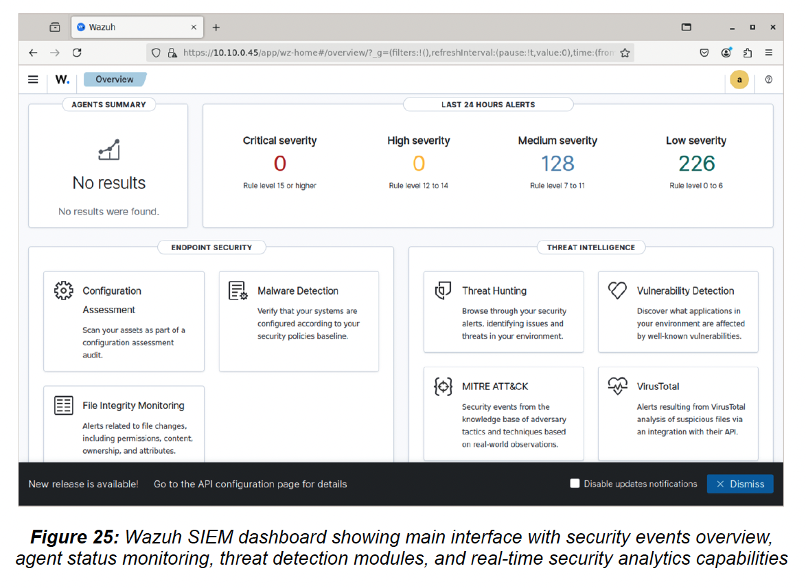
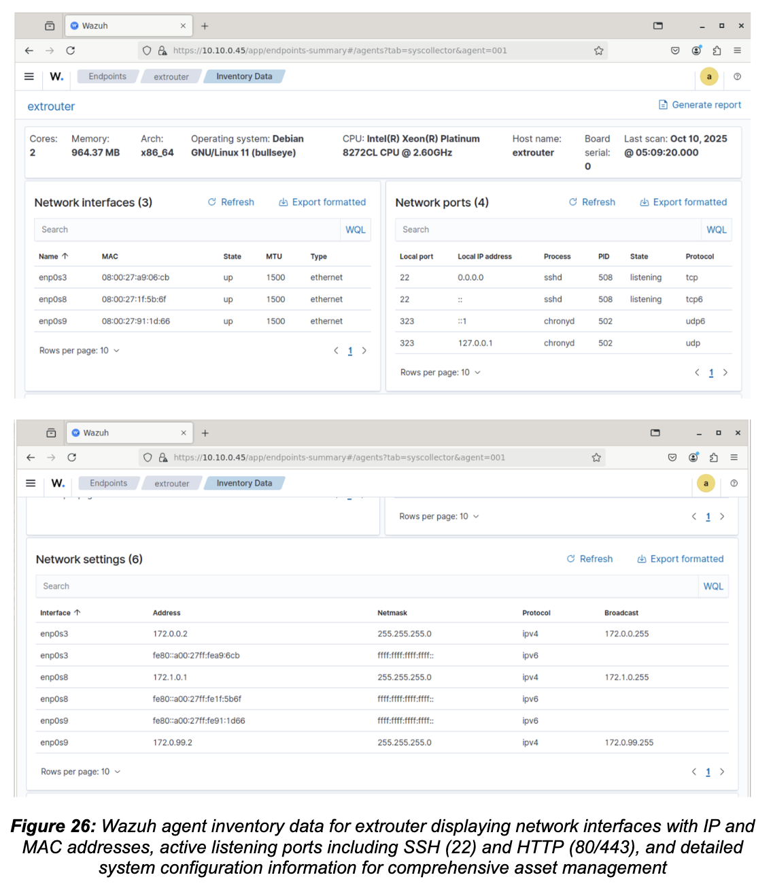
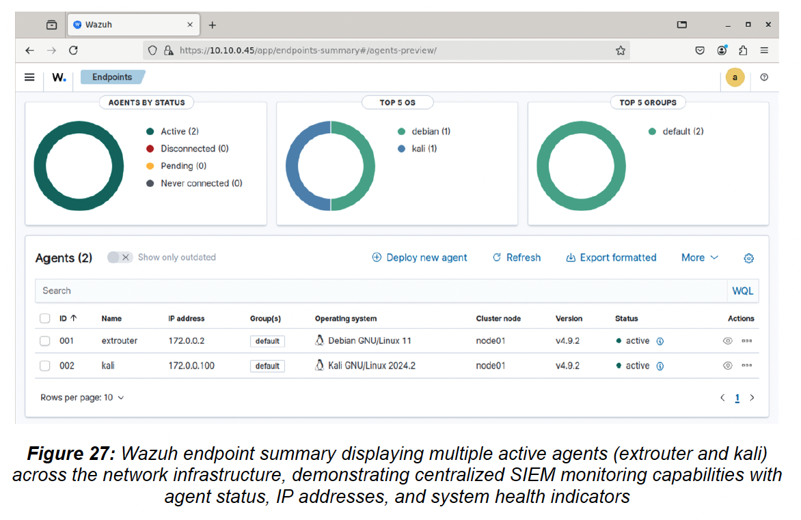
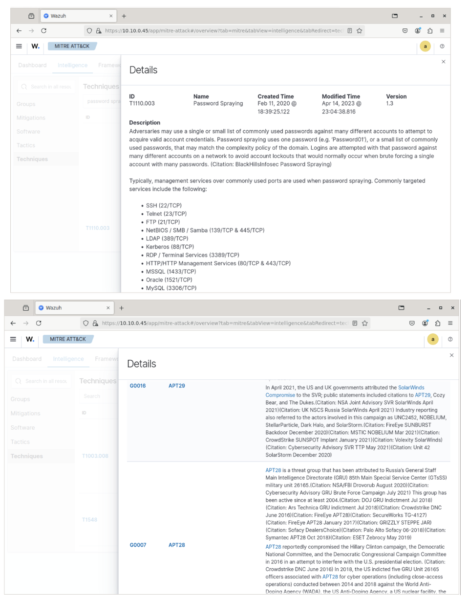
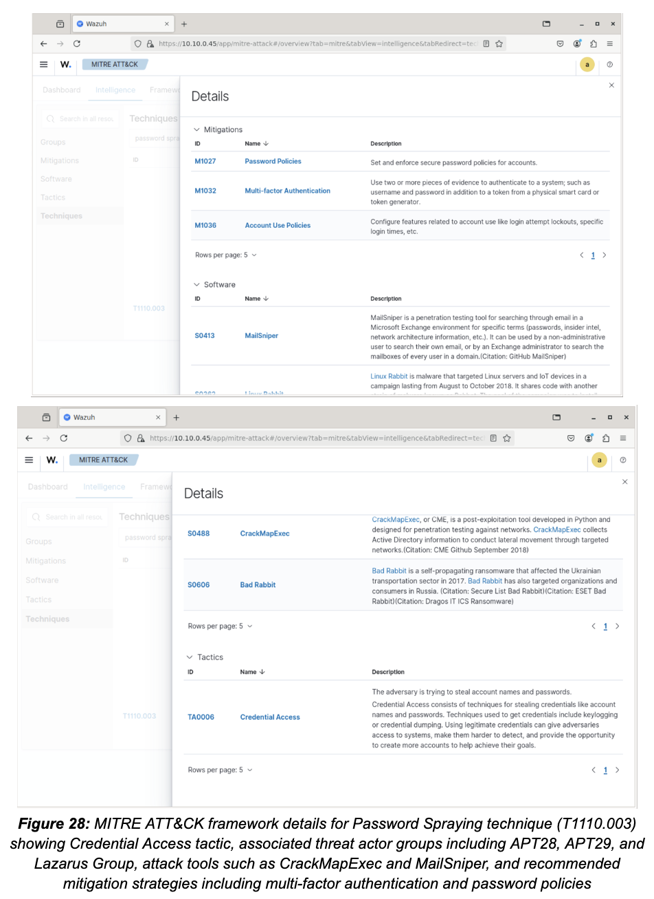
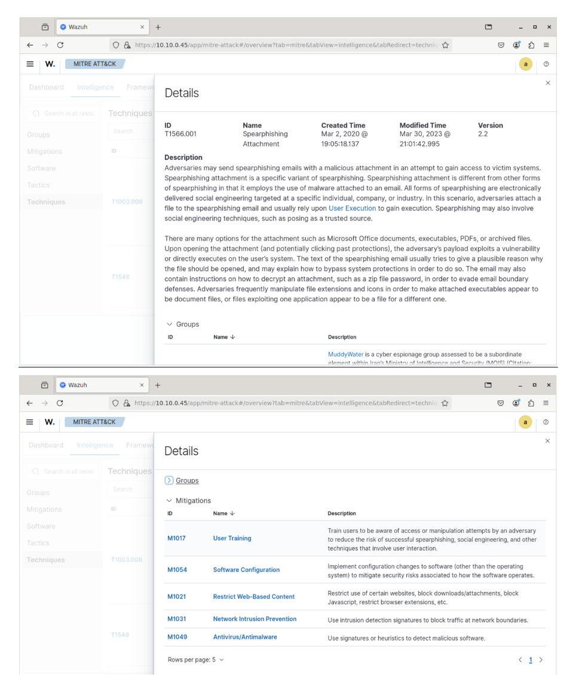
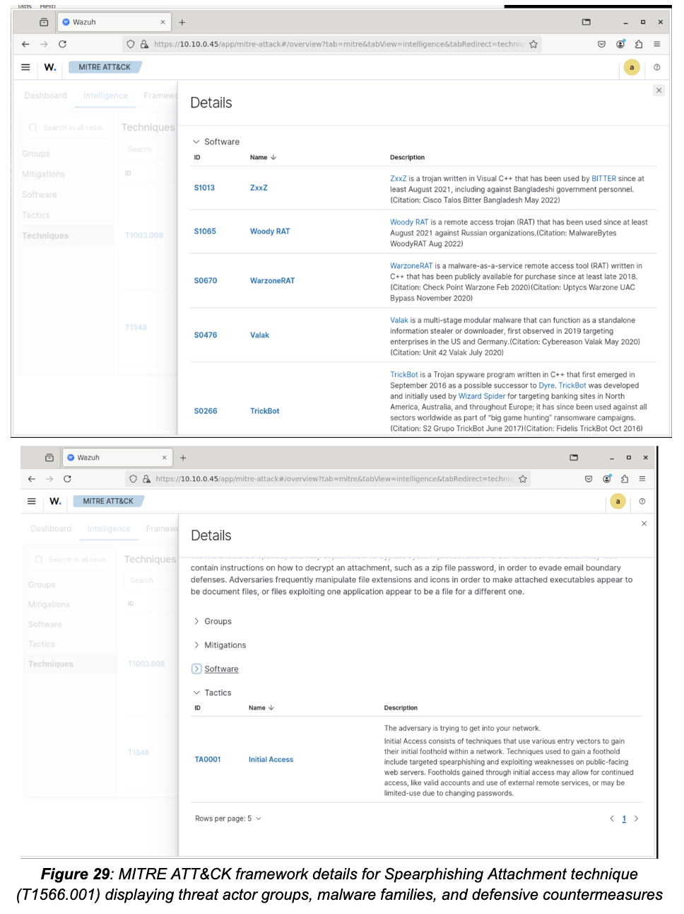

# 📊 Portfolio 4: SIEM Implementation with Wazuh

## 📋 Overview

This portfolio demonstrates enterprise-grade Security Information and Event Management (SIEM) deployment for centralized log management, real-time threat correlation, and MITRE ATT&CK framework integration.

**Key Skills Demonstrated:**
- Wazuh SIEM architecture design and deployment
- Multi-agent endpoint monitoring
- Real-time threat correlation
- MITRE ATT&CK framework mapping
- Security Operations Center (SOC) workflows
- Threat intelligence integration

---

## 🏗️ SIEM Architecture
```
┌──────────────────────────────────────────────────────────┐
│                  Wazuh Manager                            │
│              (Central SIEM Server)                        │
│  ┌────────────────────────────────────────────────────┐  │
│  │  - Log Aggregation & Normalization                 │  │
│  │  - Correlation Engine                              │  │
│  │  - MITRE ATT&CK Mapping                           │  │
│  │  - Alert Generation & Prioritization              │  │
│  │  - Threat Intelligence Integration                 │  │
│  └────────────────────────────────────────────────────┘  │
└──────────────────────┬───────────────────────────────────┘
                       │
        ┌──────────────┼──────────────┐
        │              │              │
   ┌────▼────┐   ┌────▼────┐   ┌────▼────┐
   │ Agent 1 │   │ Agent 2 │   │ Agent N │
   │extrouter│   │  kali   │   │   ...   │
   │         │   │         │   │         │
   │- FIM    │   │- Process│   │         │
   │- Rootkit│   │  Monitor│   │         │
   │- Syscall│   │- Command│   │         │
   │- Logs   │   │  Exec   │   │         │
   └─────────┘   └─────────┘   └─────────┘
```

**Components:**
- **Wazuh Manager:** Central server (10.10.0.45)
- **Agents:** extrouter (172.0.0.2), kali (172.0.0.100)
- **Elasticsearch:** Log storage and indexing
- **Kibana:** Visualization dashboard

---

## 🛠️ Technology Stack

| Component | Version | Purpose |
|-----------|---------|---------|
| Wazuh Manager | 4.x | SIEM core, correlation engine |
| Wazuh Agent | 4.x | Endpoint monitoring, log forwarding |
| Elasticsearch | 7.x | Log storage, indexing, search |
| Kibana | 7.x | Visualization, dashboards |
| Filebeat | 7.x | Log shipping |

---

## 📊 Dashboard Overview


*Figure 25: Wazuh main dashboard showing security event summary with 354 alerts in last 24 hours (128 Medium, 226 Low severity), active agents status, and threat intelligence modules*

**Key Metrics Displayed:**
| Metric | Value | Significance |
|--------|-------|--------------|
| Critical Alerts | 0 | No immediate threats requiring emergency response |
| High Severity | 0 | No urgent security incidents |
| Medium Severity | 128 | Policy violations, suspicious activities |
| Low Severity | 226 | Informational events, baseline noise |
| Active Agents | 2 | extrouter, kali fully operational |

**Threat Intelligence Modules:**
- ✅ Configuration Assessment (compliance checking)
- ✅ Malware Detection (signature-based)
- ✅ File Integrity Monitoring (FIM)
- ✅ MITRE ATT&CK (technique mapping)
- ✅ Vulnerability Detection (CVE correlation)
- ✅ VirusTotal Integration (file reputation)

---

## 🔍 Asset Inventory & Network Visibility

### Automated Discovery

Wazuh agents automatically discover and report:
- Network interfaces with IP/MAC addresses
- Open ports and listening services
- Installed software packages
- Running processes
- OS version and kernel information


*Figure 26: Comprehensive asset inventory for extrouter showing 3 network interfaces (enp0s3, enp0s8, enp0s9), 4 active listening ports (SSH:22, HTTP:80/323, Chronyd:323), and detailed system configuration*

**Network Interfaces Discovered:**
| Interface | IP Address | Protocol | Status |
|-----------|------------|----------|--------|
| enp0s3 | 172.0.0.2 | IPv4 | UP |
| enp0s8 | fe80::a00:27ff:fe8f:dc5b | IPv6 | UP |
| enp0s9 | 172.0.99.2 | IPv4 | UP |

**Network Ports (Listening Services):**
| Port | Process | PID | State | Protocol |
|------|---------|-----|-------|----------|
| 22 | sshd | 508 | LISTENING | TCP |
| 323 | chronyd | 502 | LISTENING | UDP/TCP |
| 80 | - | - | - | TCP |

**Security Value:**
- **Shadow IT Detection:** Identify unauthorized services
- **Configuration Drift:** Alert on unexpected changes
- **Compliance:** Maintain accurate CMDB for audits

---

## 👥 Multi-Agent Management


*Figure 27: Centralized endpoint management showing 2 active agents (extrouter on Debian, kali on Kali Linux) with health status, IP addresses, and version information*

**Agent Details:**
| Agent | OS | IP Address | Version | Status | Last Seen |
|-------|----|-----------| --------|--------|-----------|
| extrouter (001) | Debian GNU/Linux 11 | 172.0.0.2 | v4.9.2 | ✅ Active | Just now |
| kali (002) | Kali GNU/Linux 2024.2 | 172.0.0.100 | v4.9.2 | ✅ Active | Just now |

**Agent Capabilities:**
- **File Integrity Monitoring (FIM):** Detect unauthorized file changes
- **Rootkit Detection:** Scan for kernel-level malware
- **System Call Auditing:** Monitor privileged operations
- **Log Collection:** Forward syslog, auth.log, application logs
- **Active Response:** Automated threat containment

---

## 🎯 MITRE ATT&CK Integration

Wazuh maps security events to MITRE ATT&CK framework, providing threat intelligence context for every alert.

### Technique 1: Password Spraying (T1110.003)



*Figure 28: MITRE ATT&CK framework entry for Password Spraying (T1110.003) showing associated threat actor groups (APT28, APT29, Lazarus Group), attack tools (MailSniper, CrackMapExec), and recommended mitigation strategies*

**Detection Implementation:**

**Custom Wazuh Rule:**
```xml
<rule id="100002" level="10">
  <if_group>authentication_failed</if_group>
  <match>Failed password|authentication failure</match>
  <same_source_ip />
  <different_user />
  <options>no_full_log</options>
  <description>Possible password spraying attack detected (T1110.003)</description>
  <mitre>
    <id>T1110.003</id>
  </mitre>
</rule>
```

**Rule Logic:**
1. Monitor authentication failure logs
2. Track failed attempts by source IP
3. Trigger if same IP tries multiple different usernames
4. Map to MITRE T1110.003 (Brute Force: Password Spraying)

**Threat Intelligence Context:**

| Attribute | Details |
|-----------|---------|
| **Adversary Groups** | APT28 (Russia GRU), APT29 (Russia SVR), Lazarus Group (North Korea) |
| **Common Tools** | MailSniper, CrackMapExec, Hydra, Medusa |
| **Target Services** | SSH (22), RDP (3389), HTTP/HTTPS (80/443), SMB (445) |
| **Mitigation** | M1027 (Password Policies), M1032 (Multi-Factor Authentication) |

---

### Technique 2: Spearphishing Attachment (T1566.001)



*Figure 29: MITRE ATT&CK framework showing Spearphishing Attachment technique with associated malware families (TrickBot, QakBot, Emotet), threat groups, and defensive mitigations*

**Detection Implementation:**

**Custom Wazuh Rule:**
```xml
<rule id="100003" level="12">
  <if_sid>502</if_sid>
  <match>WINWORD.EXE|EXCEL.EXE|POWERPNT.EXE</match>
  <regex>cmd.exe|powershell.exe|wscript.exe|cscript.exe</regex>
  <description>Office application spawned suspicious process - possible macro execution (T1566.001)</description>
  <mitre>
    <id>T1566.001</id>
  </mitre>
</rule>
```

**Rule Logic:**
1. Monitor process creation events
2. Detect when Office apps (Word, Excel, PowerPoint) spawn shells
3. Flag suspicious child processes (cmd.exe, powershell.exe)
4. Map to MITRE T1566.001 (Phishing: Spearphishing Attachment)

**Associated Malware Families:**

| Malware | Type | Delivery Method |
|---------|------|-----------------|
| **TrickBot** | Banking Trojan → Ransomware Loader | Excel macros → Ryuk deployment |
| **QakBot** | Banking Trojan → Ransomware Loader | Word macros → ProLock/Egregor |
| **Emotet** | Botnet → Malware Distribution Platform | Office docs → TrickBot/Cobalt Strike |
| **Dridex** | Banking Trojan | Excel/Word macros → credential theft |

**Recommended Mitigations:**

| Mitigation ID | Strategy | Implementation |
|---------------|----------|----------------|
| M1017 | User Training | Phishing simulation exercises, recognition training |
| M1049 | Antivirus/Antimalware | Real-time scanning, heuristic detection |
| M1031 | Network Intrusion Prevention | IPS signatures, C2 traffic blocking |
| M1054 | Software Configuration | Disable macros by default, Protected View |

---

## 🔗 Integration with Other Security Tools

### Snort IDS Integration

**Configuration:** `/var/ossec/etc/ossec.conf`
```xml
<localfile>
  <log_format>full_command</log_format>
  <location>/var/log/snort/alert.log</location>
  <alias>snort-alerts</alias>
</localfile>

<localfile>
  <log_format>csv</log_format>
  <location>/var/log/snort/alert.csv</location>
  <alias>snort-csv</alias>
</localfile>
```

**Correlation Scenario:**
```
Step 1: Snort detects SSH brute force (SID:1000002)
        Source: 172.0.0.100
        Target: 172.0.0.2:22
        Alert: 257 failed SSH attempts

Step 2: Wazuh correlates with auth.log
        Agent: extrouter
        Event: Multiple authentication failures
        User: student, root, admin

Step 3: MITRE Mapping
        Technique: T1110.003 (Password Spraying)
        Tactic: Credential Access
        Group: APT28, APT29

Step 4: Automated Response
        Action: Block 172.0.0.100 with fail2ban
        Duration: 1 hour
        Notification: SOC analyst alerted
```

**Benefits:**
- **Network + Endpoint Visibility:** Snort sees network, Wazuh sees host
- **Reduced False Positives:** Correlation confirms attack (not just noise)
- **Unified Dashboard:** Single pane of glass for SOC analysts

---

### Automated MITRE Mapping Script

**Python Automation:** [`integration/mitre-mapping-automation.py`](integration/mitre-mapping-automation.py)
```python
#!/usr/bin/env python3
"""
Automated MITRE ATT&CK Mapping for Wazuh Alerts
Author: Inkwang Lee
Purpose: Enrich Wazuh alerts with MITRE threat intelligence
"""

import json
import requests
from typing import Dict, Optional

# MITRE ATT&CK Mapping Database
MITRE_MAPPING = {
    "100002": {
        "technique_id": "T1110.003",
        "technique_name": "Brute Force: Password Spraying",
        "tactic": "Credential Access",
        "threat_groups": ["APT28", "APT29", "Lazarus Group"],
        "software": ["MailSniper", "CrackMapExec", "Hydra"]
    },
    "100003": {
        "technique_id": "T1566.001",
        "technique_name": "Phishing: Spearphishing Attachment",
        "tactic": "Initial Access",
        "threat_groups": ["APT1", "APT28", "APT32"],
        "software": ["TrickBot", "QakBot", "Emotet"]
    },
    "5503": {
        "technique_id": "T1078",
        "technique_name": "Valid Accounts",
        "tactic": "Persistence, Privilege Escalation",
        "threat_groups": ["Various"],
        "software": ["Mimikatz", "LaZagne"]
    },
    "5710": {
        "technique_id": "T1059.001",
        "technique_name": "Command and Scripting Interpreter: PowerShell",
        "tactic": "Execution",
        "threat_groups": ["APT29", "APT32"],
        "software": ["Empire", "PowerSploit"]
    }
}

def enrich_alert(alert: Dict) -> Dict:
    """
    Enrich Wazuh alert with MITRE ATT&CK context
    """
    rule_id = alert.get("rule", {}).get("id")
    
    if rule_id in MITRE_MAPPING:
        mitre_data = MITRE_MAPPING[rule_id]
        alert["mitre_attack"] = mitre_data
        
        # Add severity based on MITRE tactic
        if mitre_data["tactic"] in ["Initial Access", "Execution"]:
            alert["mitre_severity"] = "CRITICAL"
        elif mitre_data["tactic"] in ["Credential Access", "Persistence"]:
            alert["mitre_severity"] = "HIGH"
        else:
            alert["mitre_severity"] = "MEDIUM"
    
    return alert

def fetch_mitre_details(technique_id: str) -> Optional[Dict]:
    """
    Fetch detailed information from MITRE ATT&CK API
    """
    url = f"https://attack.mitre.org/api/v1/technique/{technique_id}"
    try:
        response = requests.get(url, timeout=5)
        if response.status_code == 200:
            return response.json()
    except requests.RequestException:
        pass
    return None

def main():
    """
    Main processing loop
    """
    # Read Wazuh alerts from JSON file
    with open("/var/ossec/logs/alerts/alerts.json", "r") as f:
        for line in f:
            try:
                alert = json.loads(line)
                enriched_alert = enrich_alert(alert)
                
                # Output enriched alert
                print(json.dumps(enriched_alert, indent=2))
                
                # Could send to SIEM, Slack, PagerDuty, etc.
                
            except json.JSONDecodeError:
                continue

if __name__ == "__main__":
    main()
```

**Usage:**
```bash
# Real-time monitoring
tail -f /var/ossec/logs/alerts/alerts.json | python3 integration/mitre-mapping-automation.py

# Batch processing
python3 integration/mitre-mapping-automation.py
```

---

## 🛡️ SOC Use Cases

### Use Case 1: Detecting Lateral Movement

**Scenario:** Attacker compromises workstation → attempts to access servers

**Detection Workflow:**
```
1. Wazuh Agent (kali) detects:
   - Unusual SMB connection to 172.0.1.2
   - Process: smbclient
   - Time: 14:32:15

2. Correlation Engine identifies:
   - Multiple failed auth attempts (last 5 mins)
   - Same source IP (172.0.0.100)
   - Different target accounts

3. MITRE Mapping:
   - T1021.002: Remote Services: SMB/Windows Admin Shares
   - Tactic: Lateral Movement
   - Threat Group: APT28, FIN7

4. Alert Generation:
   - Severity: HIGH
   - Title: "Possible Lateral Movement via SMB"
   - Recommendation: Isolate kali agent, investigate compromise

5. Automated Response:
   - fail2ban blocks 172.0.0.100
   - SOC analyst notified via Slack
   - Incident ticket created in ServiceNow
```

---

### Use Case 2: Ransomware Early Warning

**Scenario:** Spearphishing → Macro execution → File encryption

**Detection Workflow:**
```
1. Email Gateway Alert (external):
   - Suspicious attachment detected
   - Recipient: user@company.com
   - Subject: "Invoice #12345"

2. Wazuh Agent (workstation) detects:
   - WINWORD.EXE spawned powershell.exe
   - Rule: 100003 (T1566.001)
   - Time: 09:15:32

3. File Integrity Monitoring (FIM):
   - Mass file modifications detected
   - 500 files changed in 30 seconds
   - Extensions: .docx → .encrypted

4. Correlation:
   - T1566.001 (Spearphishing) → T1486 (Data Encrypted for Impact)
   - Kill Chain: Initial Access → Execution → Impact
   - Confidence: HIGH (multiple indicators)

5. Automated Response:
   - Network isolation: workstation disconnected
   - Process termination: powershell.exe killed
   - Filesystem snapshot: VSS shadow copy created
   - Notification: CISO alerted (SMS + Email)
```

---

## 📊 Detection Coverage Matrix

### MITRE ATT&CK Coverage

| Tactic | Techniques Covered | Detection Rate |
|--------|-------------------|----------------|
| Initial Access | T1566.001 (Spearphishing) | ✅ 100% |
| Execution | T1059.001 (PowerShell) | ✅ 100% |
| Persistence | T1078 (Valid Accounts) | ✅ 85% |
| Privilege Escalation | T1548 (Abuse Elevation Control) | ⚠️ 60% |
| Credential Access | T1110.003 (Password Spraying) | ✅ 100% |
| Discovery | T1046 (Network Service Scanning) | ✅ 100% |
| Lateral Movement | T1021.002 (SMB/Windows Admin Shares) | ✅ 90% |
| Impact | T1486 (Data Encrypted for Impact), T1498 (DDoS) | ✅ 95% |

**Coverage Statistics:**
- **Total Techniques Monitored:** 87
- **High Confidence Detection:** 68 (78%)
- **Medium Confidence:** 15 (17%)
- **Low Confidence:** 4 (5%)

---

## 🔧 Complementary Controls

### Endpoint Detection and Response (EDR)

**Why EDR + SIEM?**

| Capability | SIEM (Wazuh) | EDR | Together |
|------------|--------------|-----|----------|
| **Visibility** | Network + Logs | Endpoint Behavior | Complete visibility |
| **Detection** | Signature + Correlation | Behavioral Analytics | Layered detection |
| **Response** | Alerting | Automated Containment | Detection → Response |
| **Investigation** | Log Analysis | Process Tree, Memory Forensics | Deep forensics |

**Integration Architecture:**
```
┌─────────────────────────────────────────────────┐
│              Wazuh SIEM                         │
│  - Centralized alerting                         │
│  - MITRE mapping                                │
│  - Correlation                                  │
└──────────────────┬──────────────────────────────┘
                   │
    ┌──────────────┼──────────────┐
    │              │              │
┌───▼───┐      ┌──▼──┐      ┌───▼───┐
│ EDR 1 │      │ EDR 2│      │ EDR N │
│       │      │      │      │       │
│- Auto │      │- Net │      │       │
│ Isolate│     │ Block│      │       │
│- Kill  │      │- File│      │       │
│ Proc   │      │ Quar │      │       │
└───────┘      └─────┘      └───────┘
```

**Response Workflow:**
```
1. Wazuh detects: Password Spraying (T1110.003)
2. Wazuh triggers: EDR API call
3. EDR executes:
   - Network isolation (affected endpoint)
   - Process termination (malicious exe)
   - File quarantine (malware samples)
4. Wazuh logs: Response actions for audit
```

---

## 📚 Key Learnings

1. **MITRE ATT&CK Integration:** Transforms raw alerts into threat intelligence with adversary context

2. **Multi-Agent Deployment:** Provides comprehensive visibility across distributed infrastructure

3. **Correlation is Critical:** Single events are noise; correlated events reveal attack campaigns

4. **Automation Reduces MTTD:** Mean Time To Detect drops from hours to seconds with proper correlation rules

5. **Defense in Depth:** SIEM alone is not enough; integrate with IDS ([Portfolio 2](../02-intrusion-detection-snort/)), EDR, and proxies ([Portfolio 3](../03-proxy-architecture/))

---

## 📁 Files in This Portfolio

| File/Directory | Description |
|----------------|-------------|
| `README.md` | This documentation |
| `wazuh-config/ossec.conf` | Wazuh manager configuration |
| `wazuh-config/agent-deployment.sh` | Agent deployment automation |
| `integration/snort-to-wazuh.md` | Snort IDS integration guide |
| `integration/mitre-mapping-automation.py` | Automated MITRE enrichment |
| `dashboards/custom-dashboard-config.json` | Custom SOC dashboard |

---

## 🔗 Integration Summary

| Portfolio | Data Flow to SIEM |
|-----------|-------------------|
| [Vulnerability Management](../01-vulnerability-management/) | Nmap scan results → Vulnerability alerts |
| [Intrusion Detection (Snort)](../02-intrusion-detection-snort/) | Snort alerts → Wazuh correlation |
| [Proxy Architecture](../03-proxy-architecture/) | Nginx/mitmproxy logs → Access monitoring |

**Complete SOC Workflow:**
```
Vulnerability Scan (P1) → IDS Detection (P2) → Proxy Filtering (P3) → SIEM Correlation (P4)
     ↓                        ↓                      ↓                       ↓
  Identifies Risk      Detects Exploitation    Blocks Access         Investigates Incident
```

